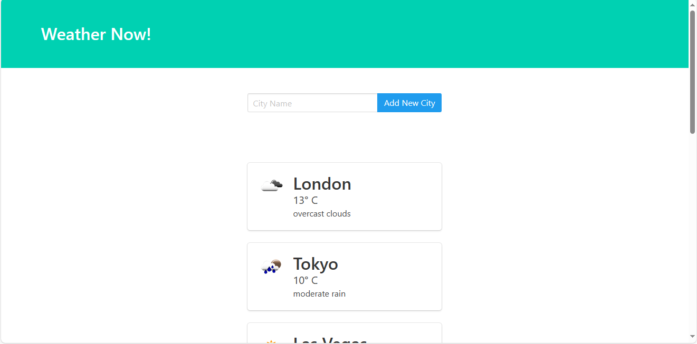

# Weather App

## Descrição
O Weather App é uma aplicação web desenvolvida em Python com o framework Django. Ele permite aos usuários visualizarem o clima atual de várias cidades em todo o mundo. Os dados do clima são obtidos através da API do OpenWeatherMap.

## Funcionalidades
- Adicionar novas cidades para monitorar o clima.
- Visualizar o clima atual de todas as cidades adicionadas.
- Atualização automática do clima a cada 30 minutos.
- Interface amigável e responsiva.

## Instalação
1. Clone este repositório em sua máquina local usando o seguinte comando:
   git clone https://github.com/JeanCalmon10/weather_app.git

2. Navegue até o diretório do projeto:
    cd weather_app

3. Instale as dependências necessárias usando o pip:
    pip install -r requirements.txt

4. Crie um arquivo .env na raiz do projeto e adicione sua chave de API do OpenWeatherMap:
    OPENWEATHERMAP_API_KEY=SuaChaveDeAPIAqui

5. Execute as migrações do Django:
    python manage.py migrate

6. Inicie o servidor de desenvolvimento:
    python manage.py runserver

7. Acesse o aplicativo no seu navegador em http://localhost:8000.

## Contribuição
Contribuições são bem-vindas! Sinta-se à vontade para abrir um PR ou uma issue para sugerir novos recursos, correções de bugs ou melhorias no código.

## Autor
Jean Calmon
